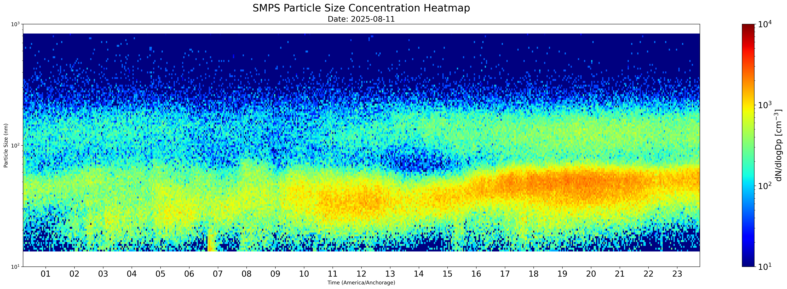
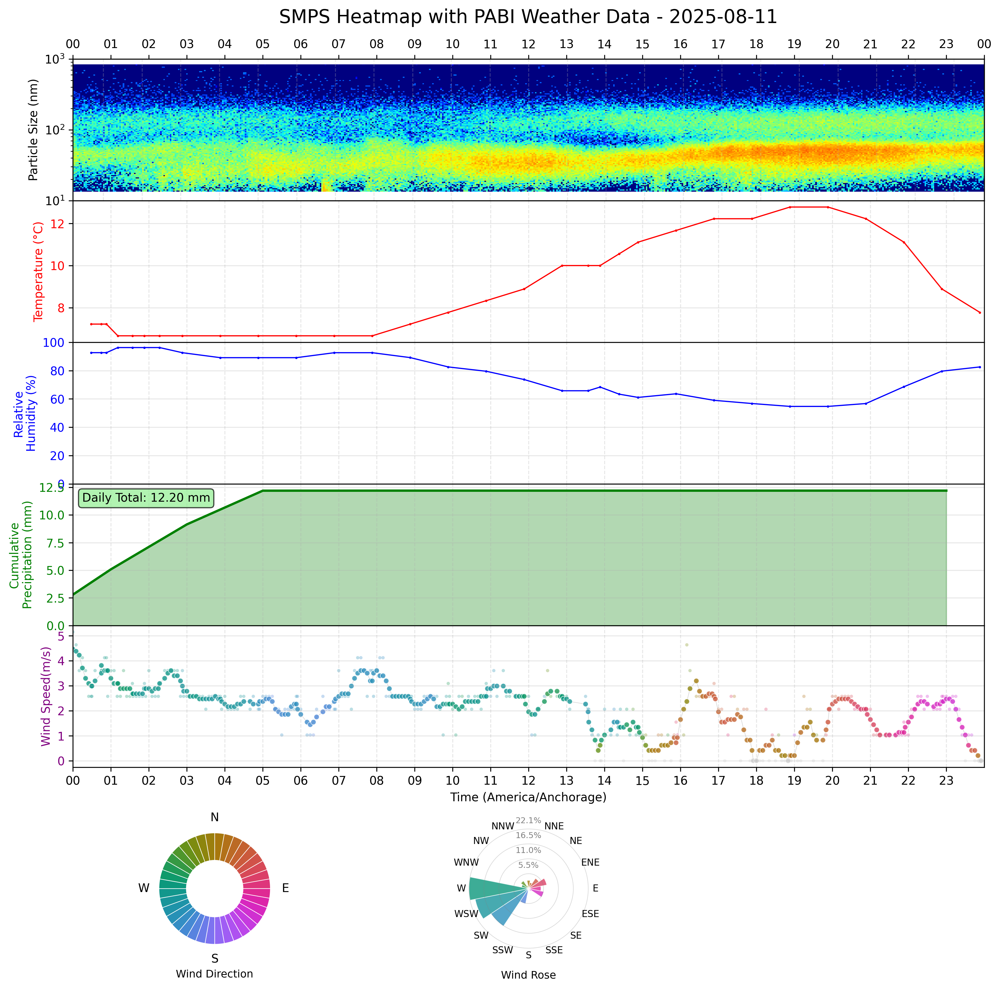

Author: Congrong Wang (me@congrong.wang)

## Setup

### Python version

\>= 3.11

If multiple versions *have to* be installed on a same PC, I personally recommend using [pyenv-win](https://github.com/pyenv-win/pyenv-win?tab=readme-ov-file) to manage different Python versions.

### Installation

1. Clone the repository:
```bash
git clone https://github.com/congrong-wang/SMPS-Hourly-Auto-Plot.git
cd SMPS-Hourly-Auto-Plot
```

2. Install dependencies:
```bash
pip install -e .
```

## Usage

1. Modify `config.py` to set your file paths and date range. Normally, file paths and time zones only need to be set once, but date range need to be adjusted each time.

2. Run the scripts directly:
   - `python hourly_autoplot.py` - For continuous hourly plotting
   - `python plot_daily.py` - To plot SMPS heat map
   
   
   
   - `python plot_SMPS_weather.py` - To plot SMPS heat map with weather
   
   

P.S. I am too lazy for now to generalize the weather station from PABI to somewhere else. You could trace down the code yourself and modify `plot_SMPS_weather.py`, it's not hard. The function called from package `cr-asos` (https://github.com/congrong-wang/cr-ASOS) is designed to be able to download and read *any* site, so you don't need bother to modify that part. Or, you can contact me, I'll try to make it up whenever I am available. 
